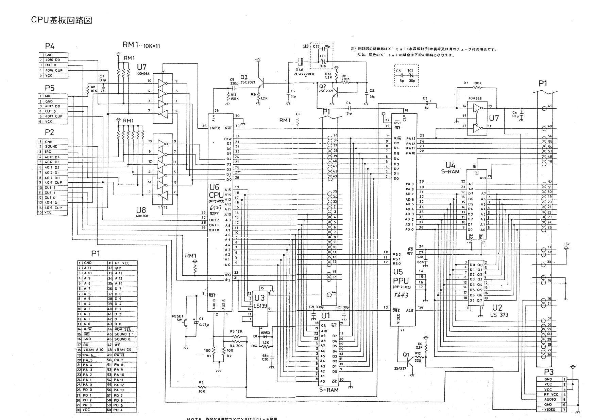
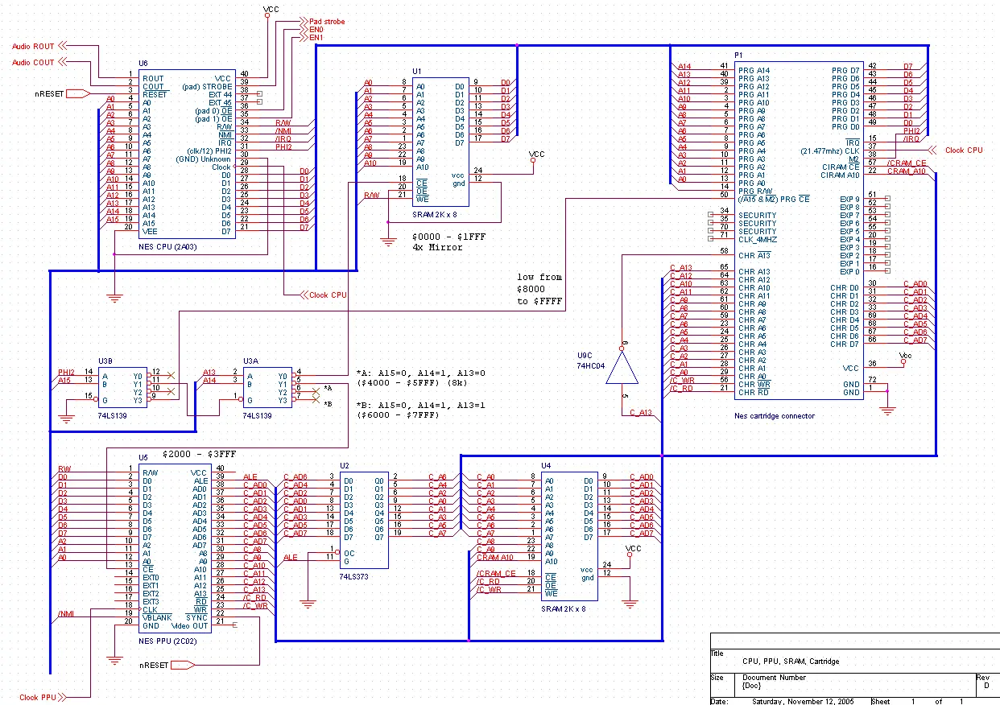
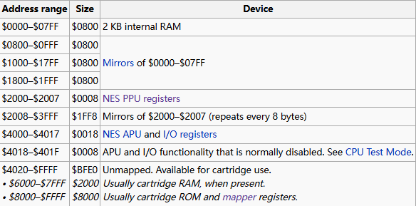

# NES硬件解析

数据资料来源[WIKI](https://zh.wikipedia.org/wiki/%E7%BA%A2%E7%99%BD%E6%9C%BA)，[NESdev](https://www.nesdev.org/wiki/Nesdev_Wiki)

硬件图纸，仅供参考：

NES即任天堂红白机，FC（Famicom），忽略外围设备，关注硬件设计，其组成如下：

CPU：理光2A03芯片，摩托罗拉6502指令集，有着2K内存

APU：音频处理器，实际硬件集成在2A03 NMOS中

PPU：显示芯片，包含2K显存

卡带：游戏数据，程序和图像，并且包含一些特殊功能

总线：传输信息，CPU和PPU单独占有一根总线，两根都连接卡带

## 内存

注意FC中使用 '\$'表示十六进制，\$06FA和C++中的0x06FA一样

### CPU内存寻址

CPU的总线有16bits，范围为\$0000----\$FFFF，总共64K

**\$0000----\$07FF**

2KB内存范围，

其中\$0000----\$00FF称为zero page，CPU可以更快的访问这些地址

\$0100----\$01FF为栈区，从\$01FF开始增长

\$0200----\$02FF无具体功能，由程序员决定

**\$0800----\$1FFF**

\$0000----\$07FF部分的三次复制，即\$0001 = \$0801 = \$1001 = \$ 1801

**\$0200----\$401F**

\$2000----\$2007为向CPU暴露的8个PPU寄存器，每8bytes重复（不知道是否错误，我觉得是8bits）

\$2000----\$3FFF为所有重复的PPU寄存器

\$4000----\$4017为APU和I/O寄存器

\$4018----\$401F为通常禁用功能

**\$4020---\$FFFF**

\$4020----\$5FFF为mapper扩展区域

\$6000----\$7FFF为带电RAM，即FC上卡带的扩展内存

\$8000----\$FFFF为程序数据，位于卡带上

### PPU内存寻址

PPU的总线有14bits，范围为\$0000----\$3FFF，总共16K

**\$0000----\$1FFF**

8K（映射出来的）图像数据，位于卡带上

**\$2000----\$2FFF**

## CPU

2A03CPU等同于6502CPU集成APU